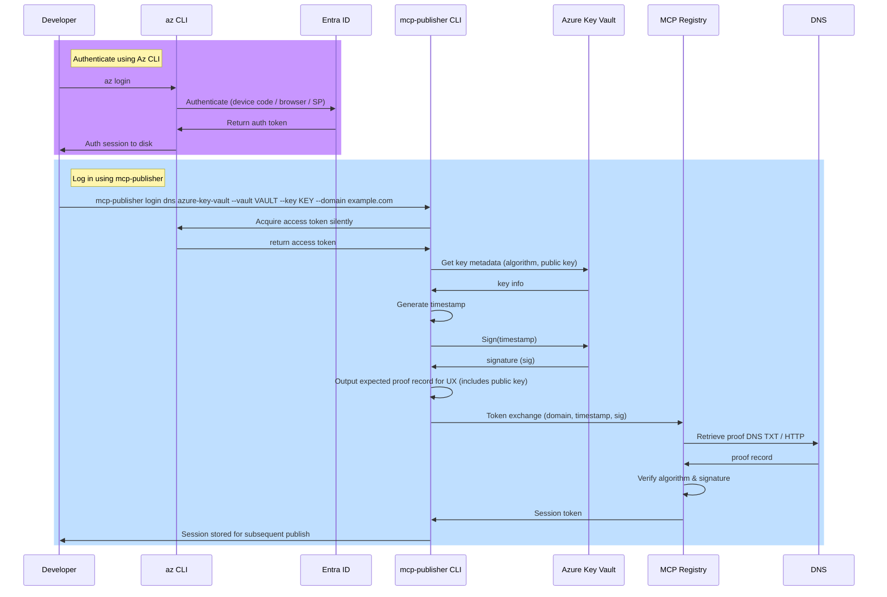

# Securing authentication private keys

- Author: Joel Verhagen
- Date: October 1, 2025
- Issue: https://github.com/modelcontextprotocol/registry/issues/482

## Introduction

Today, the Community MCP Registry supports the following authentication methods for publishing MCP Servers:

- GitHub (OIDC or interactive)
- HTTP
- DNS

See the [publish a server](https://github.com/modelcontextprotocol/registry/blob/747ad310bba75d80f20c1dd03051dd825df734e0/docs/guides/publishing/publish-server.md) guide for more information on the current authentication flows.

The HTTP and DNS authentication mechanisms use a cryptographic private key to sign a payload that is sent to the MCP Registry for authentication. Currently, the private key is passed into the publisher tool as a command-line argument.

This requires that the private key, the sole factor needed to publish to the MCP Registry under a domain-rooted namespace, reside in memory on the client machine that is performing the publish action.

Because the private keys have no expiration, improper access to the private key could result in persistent, adversarial access to the MCP server namespace, enabling malicious payloads to be published and in turn delivered to the end users of the MCP Server.

This document proposes an alternative signing flow using cloud-based secret stores. For example, Google Cloud has KMS (Key Management Service), AWS has KMS (also Key Management Service), and Azure has Key Vault. Cryptographic signing operations are performed in the cloud and the client machine has no direct access to the private key, reducing the risk of compromise. This does not eliminate the risk of compromise. The credentials used for cloud authentication or the token produced by the `login` action can still be leaked, but the risk is lower since generally these are time-bound factors.

This document will focus on how cloud-specific options will be surfaced in the publisher tool and how the tool itself will integrate with a cloud secret store.

For the purpose of this document, I will refer to a "cloud secret store" as a "signing provider" since that more specifically describes the purpose it is serving here (delegating a sign operation out of process). The term "signing provider" also leaves the door open for signing providers not exactly like cloud services such as Azure Key Vault or Google KMS.

## Current CLI flow

When a user wants to publish a new version of their MCP server to the registry, they execute two commands:

```bash
# sign in using a private key and DNS verification
# the 'http' method has the same pattern as 'dns'
./mcp-publisher login dns --domain mcp.joelverhagen.com --private-key HEX_PRIVATE_KEY

# publish a com.joelverhagen.mcp/* server
./mcp-publisher publish --file=./server.json 
```

The second command (publish) will not be affected by this proposal. We will focus on the `login` action, which fetches a token from the registry using some authentication factor. The token is saved to a session file on disk to allow subsequent `publish` actions.

For the `dns` and `http` methods, a private key is needed to sign a timestamp. The timestamp, the signature, and the domain are provided in a token exchange request to the MCP Registry. The part we are focused on is how the signature is generated if a `--private-key` argument is not available.

## Secret store options

I propose a third optional positional argument for the `login` step:

```bash
./mcp-publisher login METHOD [SIGNING_PROVIDER] --domain mcp.joelverhagen.com
```

When `METHOD` is `dns` or `http`, the third positional argument will be checked against a list of supported signing providers. 

The initial list of signing providers will be:

- `google-kms` - Sign using Google Cloud KMS
- `azure-key-vault` - Sign using Azure Key Vault

AWS or any other analogous cloud signing service can be added by a community member when it is needed. Google KMS will be added initially to align with the registry's selected cloud platform. Azure Key Vault will be added initially because this is what I need for my team at Microsoft.

If the third argument is not a recognized signing provider or if the method does not support signing providers, the existing behavior will be retained—the third argument is parsed by the flag set and is not treated as a signing provider name.

When a recognized signing provider is found, additional flags will be added to the flag set that are specific to the signing provider.

For `google-kms`, the following flags will be added:

- `--resource`: the resource name of the signing key
  - Pattern: `projects/<project>/locations/<location>/keyRings/<key ring>/cryptoKeys/<key>/cryptoKeyVersions/<version>`
  - It can be easily copied from the GCP console web interface for KMS

For `azure-key-vault`, the following flags will be added:

- `--vault`: the name of the Key Vault resource in the Azure global cloud
- `--key`: the name of the key resource to use for signing

Creating the key resource is out of scope for the login command. The user must create the resource themselves, ensure a key type supported by the MCP Registry is selected, and set up proper permissions to access the key resources.

## Signing provider authentication

Authentication between the publisher tool and the signing provider is specific to the signing provider. The design principle I propose is to, where possible, delegate authentication to transparent, parameterless, cloud-specific APIs to keep the publisher tool as simple as possible. I'll explain more of what I mean with Google Cloud and Azure examples.

For `google-kms`, the authentication will be performed using the [Application Default Credentials (ADC)](https://cloud.google.com/docs/authentication/application-default-credentials) flow. First, the user will establish a Google Cloud session using the `gcloud auth application-default login` command. They can choose to use interactive sign-in or service principal authentication, as long as the signed-in entity has proper permissions for the key. Then, they will execute the `mcp-publisher login dns|http google-kms` command. This command will use the [`NewKeyManagementClient`](https://pkg.go.dev/cloud.google.com/go/kms/apiv1#NewKeyManagementClient) function to create a KMS client. By default, this uses ADC to find the credential established by the earlier `gcloud` command.

For `azure-key-vault` and similar to the `gcloud` flow, the user will first use `az login` from the Azure CLI to establish a session. Then, they will execute the `mcp-publisher login dns|http azure-key-vault` command. This command will use the [`NewDefaultAzureCredential`](https://pkg.go.dev/github.com/Azure/azure-sdk-for-go/sdk/azidentity#NewDefaultAzureCredential) API to authenticate with Azure Key Vault. Internally, this credential type has support for several token providers such as one that uses the Azure CLI.

Any additional metadata needed, such as the key type, should be fetched using the cloud-specific SDK. This is to reduce the number of parameters needed by the publisher tool. Generally speaking, the name or location identifiers for the cryptographic key resource should be enough. Conceptually these operate as a "URI" for the key resources. How to interact with the resource (auth, crypto parameters) and what the public key is are implied by the key name parameters. For future signing providers, authentication-specific flags may be needed such as a username or authentication token.

## Signing capabilities of a cloud service

The types of keys supported by each signing provider vary.

Google Cloud supports many key types. Critically, it supports both Ed25519 and ECDSA P-384. Ed25519 has been supported by the publisher tool since the current authentication method was implemented. ECDSA P-384 is proposed by the [Crypto Agility](./2025-09-crypto-agility.md) design proposal.

Azure Key Vault does not support Ed25519 but does support ECDSA P-384.

If the key specified by CLI arguments is of a cryptographic algorithm that isn't supported (such as an RSA key pair or an unsupported ECDSA curve), the tool MUST error out and provide the user with a helpful error message. There is no risk of improper access because a signature produced by a cryptographic algorithm not supported by the registry will fail to validate against the public key found by DNS or HTTP.

## Finding the public key

When a key is created in a cloud signing service, it is not always apparent to the end user what the public key is or how that public key should be expressed in the DNS TXT records or HTTP response body.

Therefore, the tool will print out the expected proof record prior to performing the token exchange with the registry. The output would look something like:

```
Signing using Google KMS with key algorithm ed25519
Expected proof record:
v=MCPv1; k=ed25519; p=OHjrTGdvR2dFk1g5uTVNJ4/RxpDLYjVJTtTQlcwW0Jg=
✓ Successfully logged in
```

This allows the MCP Server author to easily copy the value and paste it in their DNS name records or web server for HTTP authentication.

Note that if the public key is not known or set up (for example, if this is the first publish attempt), the `login` command will fail with an incorrect signature error, but the user will have the information they need to fix the problem and try again.

## Alternatives considered

Both `gcloud` CLI and `az` CLI support signing operations from the CLI. Another approach to this design could be invoking these CLIs inside the publisher tool. This could reduce the number of new Go dependencies needed (no new cloud SDK dependencies). However, this couples the design to CLI integration, which generally has a less stable contract than an API provided by a Go package. Additionally, process management has its own complexities related to lifetime and input/output marshalling.

Another approach could be capturing a signature in an environment variable or file directly with CLI, and passing the signature into the publisher tool as a parameter. The signature could be produced by `gcloud` or `az` CLI prior to executing the publisher tool. This is similar to the existing approach where the "secret" thing is passed in as a parameter (now a specific signature instead of the whole private key). The drawback of this approach is that it requires both the timestamp and the timestamp's signature to be passed as parameters (two parameters over one). There are also timing concerns where a slow-running sequence of commands could lead to an authentication failure. The timestamp must be within 15 seconds of the current clock time on the registry. If the signing happens in-process to the publisher tool, it is easier to control timing issues and move steps like cloud service authentication and key type discovery prior to the timestamp capture and signing operation.

Another approach could be storing the private key as a secret (opaque, fetchable secret value) in the cloud secret store, instead of as a cryptographic key. This would allow the user to fetch the full private key from the secret store and pass it into the existing `login` `--private-key` parameter. This means no changes would be needed to the publisher tool. But the drawback is that the private key would exist in memory on the client machine that is running the publisher tool. This increases the risk of key compromise. Additionally, this approach is not compliant in some enterprise environments, such as at Microsoft where keys must be stored in HSM-backed key stores like Azure Key Vault.

## Sequence diagrams

### Azure Key Vault login flow (DNS or HTTP)


